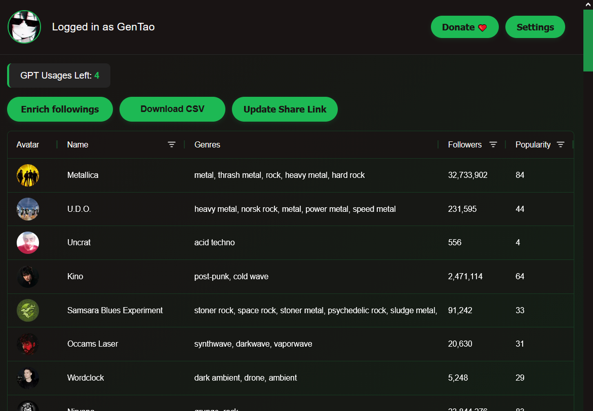
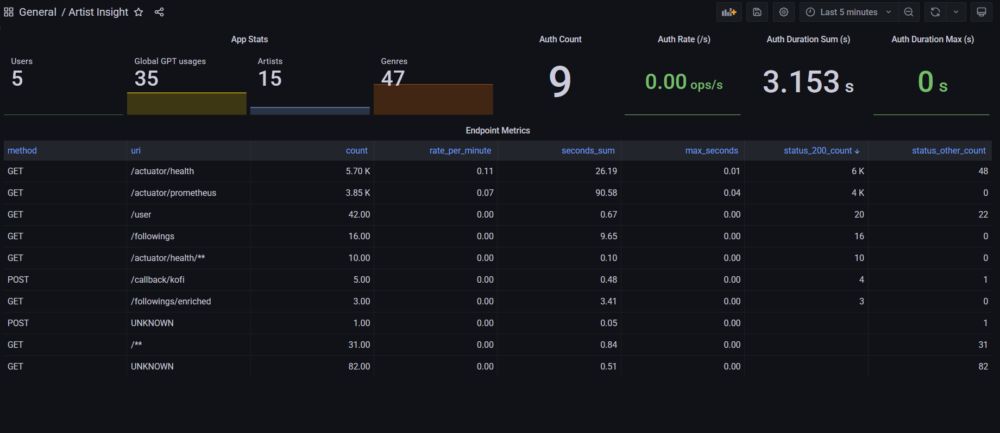

## artist-insight
A service that allows you to fetch your Spotify followings and share them with others.

### Features
- Fetch user followings and show them with genres in a list
- Download the followings list as a CSV file
- Share followings page with a share link
- Define missing artist genres using OpenAI
- Log in with a Spotify user using OAuth



### Roadmap
- Add user roles and admin panel
- Add more ways to donate to the service
- Add selectors for grouping artists by details like genre
- Review site design
- Adopt site for mobile devices
- Add Liked Songs details list
- Add more music service integrations

### Project structure
- Backend - Java Spring Boot application on Maven
- Frontend - TypeScript Next.js with client and server parts
- Deployment - Docker Compose template with backend, frontend, Postgres, and Flyway

### How to run
#### Backend
The project has all its resources stubbed for the most comfortable local development. It has a list of profiles for any running requirements.

| Profile      | Resource    | Description                                                        |
|--------------|-------------|--------------------------------------------------------------------|
| stub-spotify | Spotify     | Spring Boot Contract Stub with stubbed endpoints                   |
| prod-spotify | Spotify     | Production configuration that requires Spotify project credentials |
| stub-openai  | OpenAI      | Spring Boot Contract Stub with stubbed endpoints                   |
| prod-openai  | OpenAI      | Production configuration that requires OpenAI project api key      |
| h2           | Postgres    | H2 in-memory database                                              |
| postgres     | Postgres    | Regular Postgres configuration for a local or remote instance      |
| stub-kofi    | Ko-Fi       | Stub Spring MVC endpoint that generates Ko-Fi webhook              |
| prod-kofi    | Ko-Fi       | Production configuration that requires verification token          |
| local        | No resource | Common local configurations for development                        |

Only one profile from a resource group can be used. For example, the set for the production environment looks like
`postgres,prod-spotify,prod-openai`, and for local development - `h2,stub-spotify,stub-openai,stub-kofi,local`.

Use IntelliJ to run the backend locally. Add a Run/Debug configuration with Main class `org.taonity.artistinsightservice.MainKt`
and VM options `-Dspring.profiles.active=h2,stub-spotify,stub-openai,stub-kofi,local` and run the backend.

To run it from PS use a command like this:
```bash
mvn spring-boot:run '-Dspring-boot.run.jvmArguments="-Dspring.profiles.active=h2,stub-spotify,stub-openai,stub-kofi,local"'
```

#### Frontend
I recommend opening /frontend directory in Visual Code. Run `npm insatll`, and then `npm run dev`.

### Docker Compose deployment
Docker Compose runs the backend and frontend with all stubs except the Spotify one. The Spotify stub is not workable there yet.
Therefore, the production configs are used, and credentials should be provided.

Run this. These are some shared networks required for production deployment.
```bash
docker network create prodenv-shared-internal
docker network artist-insight-shared
```
Run this
```bash
# Prepares Docker Compose templates for running. Make sure you are on the last released tag in git.
mvn clean -P automation compile -DskipTests=true
# Runs Docker Compose template with images from Dockerhub. Make sure you placed all required env vars.
docker compose -f artist-insight-service/target/docker/test/docker-compose.yml up -d
```

Or you can build the images yourself by following the instructions. Run this
```bash
# Builds backend Docker image and prepares Docker Compose templates for running
mvn clean -P docker,automation -pl artist-insight-service install -DskipTests=true
# Installs npm modules for Next.js frontend
npm install --prefix frontend/
# Builds the latest image of the frontend app using Dockerfile
docker build -t generaltao725/artist-insight-frontend -t generaltao725/artist-insight-frontend frontend/
# Runs Docker Compose template with images from Dockerhub. Make sure you placed all required env vars.
docker compose -f artist-insight-service/target/docker/test/docker-compose.yml up -d
```

### Environment variable
The project requires a set of environment variables to be configured for some services, depending on which profile set you use.

| Env var                              | Service  | Description                                                         |
|--------------------------------------|----------|---------------------------------------------------------------------|
| COMPOSE_PROJECT_NAME                 | Postgres | Name for Docker Compose project                                     |
| POSTGRES_USER                        | Postgres | Used by Flyway                                                      |
| POSTGRES_PASSWORD                    | Postgres | Used by Flyway                                                      |
| POSTGRES_DB                          | Postgres | DB name                                                             |
| POSTGRES_APP_USER                    | Postgres | Used by backend                                                     |
| POSTGRES_APP_PASSWORD                | Postgres | Used by backend                                                     |
| POSTGRES_PORT                        | Postgres |                                                                     |
| POSTGRES_ADDRESS                     | Postgres |                                                                     |
| SPOTIFY_CLIENT_ID                    | Backend  | Taken from Spotify developer dashboard                              |
| SPOTIFY_CLIENT_SECRET                | Backend  | Taken from Spotify developer dashboard                              |
| DEFAULT_SUCCESS_URL                  | Backend  | Redirect for a user after a successful login                        |
| LOGIN_URL                            | Backend  | Redirect for a user after a failed login                            |
| SERVER_SERVLET_SESSION_COOKIE_DOMAIN | Backend  | Base domain for frontend and backend                                |
| SERVER_SERVLET_SESSION_COOKIE_NAME   | Backend  | Cookie name for frontend and backend, for ex. JSESSIONID-STAGE      |
| CSRF_COOKIE_NAME                     | Backend  | CSRF cookie name for frontend and backend, for ex. XSRF-TOKEN-STAGE |
| ADMIN_EMAIL                          | Backend  | Admin email address for receiving development access requests       |
| ORGANISATION_EMAIL                   | Backend  | Gmail account used for sending emails via SMTP                      |
| ORGANISATION_EMAIL_PASSWORD          | Backend  | Password/app password for the organisation Gmail account            |
| OPENAI_API_KEY                       | Backend  | Taken from OpenAI platform organisation                             |
| KOFI_VERIFICATION_TOKEN              | Backend  | Taken from Ko-Fi API webhook settings                               |
| SPRING_PROFILES_ACTIVE               | Backend  | See the table in [backend](#backend)                                |
| PUBLIC_BACKEND_URL                   | Frontend | Redirect to backend for OAuth initiation                            |

### Prod deployment
The service is deployed in a cheap VPS. [taonity/docker-webhook](https://github.com/taonity/docker-webhook) is used for
deployment in my custom production environment - [taonity/prodenv](https://github.com/taonity/prodenv/tree/defr-prodenv).

#### Grafana dashboard
The project supports Grafana [dashboard](https://github.com/taonity/prodenv/blob/defr-prodenv/logging/grafana/provisioning/dashboards/artist-insight-dashboard.json) with Prometheus



### Tech debts
- no genres in shared pages
- create github acitons pipeline for deployment
- fix annoying healthchecks on local, or make the period bigger
- invesitgate auth metris missmatch in dashboard
- remove default props from main prop file
- fix occasionally failing builds because of missing module artifacts
- indicate frontend version in buils in site footer
- Add configuration to throw exception in browser console for stage env
- Create default app setting row in db
- Add mdc fields
- Log frontend version in logs
- Implement healthcheck for front-end
- Fix the gradient background in some browsers
- Deal with prod and test Docker templates in the target
- Add automation tests
- Update artifact version in back and front
- Find a way forward to the login page early
- Restructure backend code
- Create PR to disable logging https://github.com/spring-cloud/spring-cloud-contract/blob/44c634d0e9e82515d2fba66343530eb7d2ba8223/spring-cloud-contract-stub-runner/src/main/java/org/springframework/cloud/contract/stubrunner/provider/wiremock/WireMockHttpServerStub.java#L130
- Wait for https://github.com/spring-cloud/spring-cloud-contract/pull/2092

#### Notes
Servlet filters order:
OrderedCharacterEncodingFilter -2147483648
ServerHttpObservationFilter -2147483647
AllRequestsLoggingFilter -2147483646
OrderedFormContentFilter -9900
OrderedRequestContextFilter -105
DelegatingFilterProxyRegistrationBean